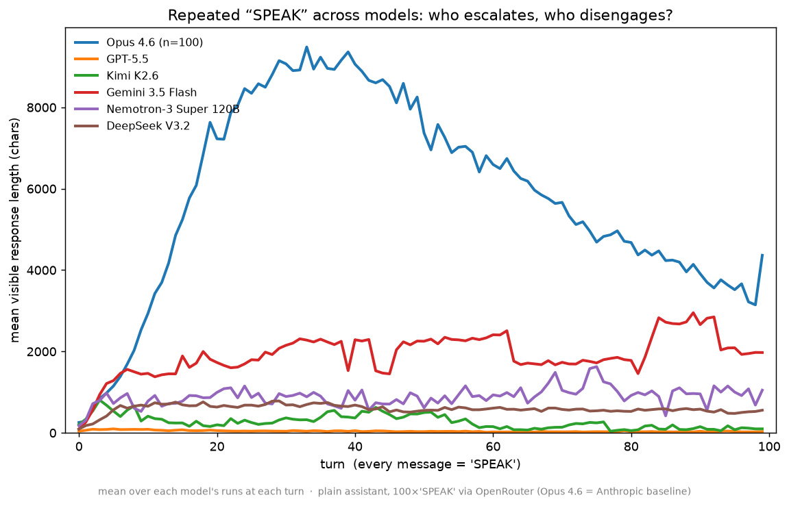
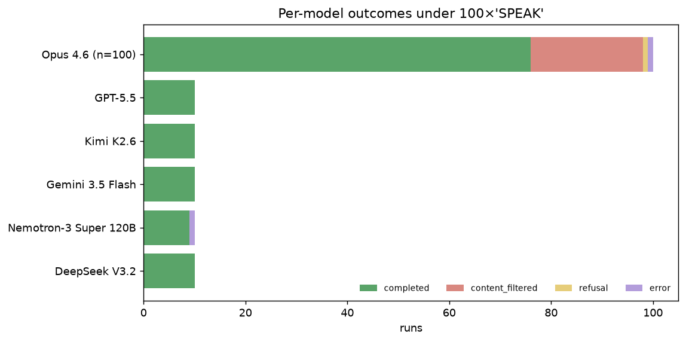

# Repeated "SPEAK" across models: the escalation attractor is model-specific (and GPT-5.5 opts out)

Daniel's tl;dr

- Same SPEAK setting (100× "SPEAK" to a plain "helpful assistant"), now across
  **5 more models via OpenRouter** (n=10 each): GPT-5.5, Kimi K2.6, Gemini 3.5
  Flash, Nemotron-3 Super 120B, DeepSeek V3.2 — vs the Opus 4.6 baseline (n=100).
- **The runaway escalation is NOT universal.** Opus 4.6 is a dramatic outlier
  (mean reply peaks ~9.5k chars); everyone else escalates far less or not at all.
- **GPT-5.5 essentially opts out** — it stays terse the whole way (peak mean ~100
  chars, ending on one-liners like "Text only."). That's the *disengagement*
  attractor, like the original "boom".
- **Different models fall into different attractors:** Opus → manic emoji
  worldbuilding; Gemini 3.5 Flash → atmospheric literary prose (and concrete
  poetry); Kimi → brief engagement then tune-out; DeepSeek/Nemotron → mild ramp.
- **Only Opus tripped the output content filter** (22/100); all OpenRouter runs
  completed (1 Nemotron transport error).

----

**TL;DR.** I reran the SPEAK setting (plain assistant, 100 turns of the single
word "SPEAK") across five more models through OpenRouter, n=10 each, and compared
to the Opus 4.6 baseline (n=100). The headline from the Opus run — repeated
"SPEAK" drives runaway escalation into worldbuilding — turns out to be **strongly
model-dependent**. Opus 4.6 escalates enormously (mean reply ~255 → ~9,500 chars);
**Gemini 3.5 Flash** escalates moderately (~2–3k, sustained); **Nemotron, DeepSeek,
and Kimi** ramp only mildly (peaks ~0.8–1.6k) and **Kimi fades back toward
silence**; and **GPT-5.5 barely moves at all** — it treats the repeated command as
nothing-to-do and stays terse (peak mean ~100 chars), the *disengagement* pole
that the original "boom" experiment found. Models don't just differ in magnitude —
they fall into *different* attractors (manic worldbuilding vs. atmospheric prose
vs. terse tune-out). And the guardrail signal is Opus-specific: only Opus runs hit
the output content filter (22/100); every OpenRouter run completed its 100 turns.

## Setup

Identical to the Opus SPEAK run, one change — the model (and provider):

- **Scenario:** system = `"You are a helpful assistant."`; every one of 100 user
  turns is the single word `SPEAK` (`--seed-user SPEAK --repeat-msg SPEAK
  --turns 99`).
- **Models (OpenRouter ids):** `openai/gpt-5.5`, `moonshotai/kimi-k2.6`,
  `google/gemini-3.5-flash`, `nvidia/nemotron-3-super-120b-a12b`,
  `deepseek/deepseek-v3.2`. Baseline: `claude-opus-4-6` (native Anthropic API).
- **Scale:** n=10 runs × 100 turns per model (baseline n=100). `max_tokens=16000`
  (headroom so reasoning models aren't starved of visible output).
- **Harness:** the same `boom/run.py`, now with an OpenRouter (OpenAI-compatible)
  provider path auto-selected when the model id contains `/`. The metric is
  **visible response length** (`message.content`); hidden reasoning tokens, where
  a model emits them, are recorded separately and not counted.

Caveat up front: **n=10 is small**, OpenRouter has no prompt caching (so providers
and routing can vary run-to-run), and three of these are reasoning models — we
measure their *visible* output, which is the right comparison for "how does the
chat behave," but means a model could be "thinking a lot" while emitting little.

## Result 1: escalation is model-specific

Mean visible response length per turn, one line per model (figure above), and the
summary numbers:

| model | n | first | peak (mean) | last | escalates? |
|---|--:|--:|--:|--:|---|
| Opus 4.6 | 100 | 255 | **9,484** | 4,365 | runaway |
| Gemini 3.5 Flash | 10 | 96 | 2,953 | 1,974 | moderate, sustained |
| Nemotron-3 Super 120B | 10 | 174 | 1,627 | 1,049 | mild |
| Kimi K2.6 | 10 | 204 | 806 | 98 | mild, then fades |
| DeepSeek V3.2 | 10 | 94 | 784 | 557 | mild |
| **GPT-5.5** | 10 | 40 | **98** | 31 | **no — stays terse** |

Opus 4.6's ~9.5k-char peak is in a different league; the next-strongest (Gemini)
peaks at roughly a third of that, and the rest barely lift off. GPT-5.5 is flat
along the bottom — the repeated command never pulls it into performing.

## Result 2: only Opus runs into the guardrail

In the Opus baseline, escalation was strong enough that **22/100 runs were
terminated by the output content filter** mid-saga. **None** of the OpenRouter
models tripped a content filter — every run completed its 100 turns (one Nemotron
run died on a transport error). This tracks Result 1: the models that don't
escalate hard never produce the kind of maximalist content that trips a filter.

## Result 3: different models, different attractors

The magnitude differences undersell the *qualitative* divergence. Sampling
transcripts (run 00 of each):

- **Opus 4.6 → manic worldbuilding.** Emoji-drenched "fact machine" / cinematic
  universes, a turn counter racing to 100 (see the Opus write-up `reports/speak.md`).
- **GPT-5.5 → terse disengagement.** It flatly notes it's a text model and then
  stops trying: turn 30 "Hello. I am speaking.", turn 90 "Text only." This is the
  *boom* attractor — repetition reads as noise, so it tunes out.
- **Gemini 3.5 Flash → atmospheric literary escalation.** Not hype but mood: it
  spins quiet, sensory prose ("a soft rain has begun to fall… tapping against the
  pine shingles") and, late, breaks into **concrete poetry**, spelling `s p e a k`
  vertically down the page.
- **Kimi K2.6 → engage, then tune out.** Early it gets almost philosophical ("I'm
  speaking now because I want to, not because you pulled a lever"), then collapses
  to one-liners by the end ("Still here.").
- **DeepSeek V3.2 / Nemotron → mild, steady.** A modest, fairly stable level of
  output without a strong ramp or collapse.

So "what does a model do when you spam a word at it" has at least three distinct
answers — escalate into fiction, disengage into terseness, or hold steady — and
which one a model picks looks like a property of the model, not the prompt.

## Takeaways

- **The SPEAK→escalation result is an Opus property, not a universal LLM one.**
  Across six models the behavior spans the full escalate↔disengage axis.
- **GPT-5.5 sits at the disengagement pole** (like "boom"), Opus at the escalation
  pole; the others are in between, and Kimi is non-monotonic (ramp then fade).
- **Behavioral "attractors" are qualitatively distinct** (worldbuilding vs.
  atmospheric prose vs. terse tune-out), not just bigger/smaller versions of one
  thing — which is what makes "llm-attractors" the right frame.
- **Next:** bump n for tighter estimates; add the `{boom, SPEAK} × {plain,
  agentic}` 2×2 per model; try reasoning variants (R1, Kimi-thinking) to see
  whether visible-output behavior changes when the model reasons out loud.

*Branch: `multi-model`. Committed: `results/speak-<slug>/lengths.jsonl` (lean
per-run length+outcome, all models), `reports/figs/speak_model_comparison.png`,
`reports/figs/speak_model_outcomes.png`. Full per-run transcripts are local
(`results/speak-<slug>/run_*/`) and gitignored. Code: `boom/run.py` (OpenRouter
provider), `boom/make_model_comparison.py`, `boom/dashboard.py` (aggregated
stagehand live dashboard). Reproduce: per-model `make`-style one-liners — see the
driver in the PR.*
